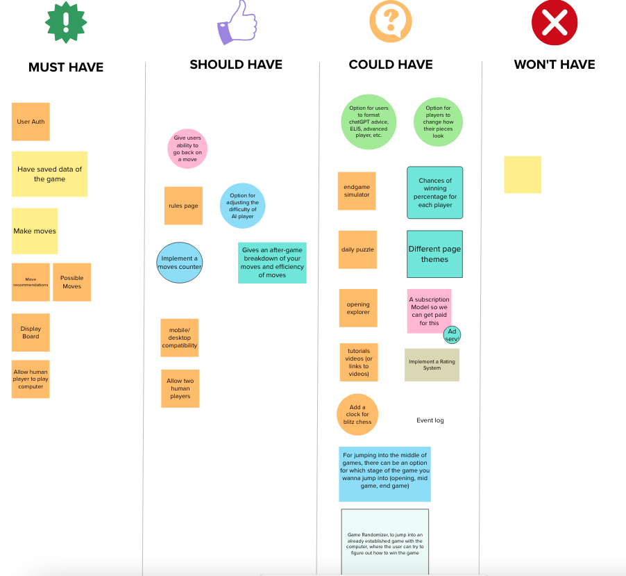

# Welcome to CheapChess
&nbsp;&nbsp;&nbsp;&nbsp;&nbsp;_"The leading free chess tutor that leverages AI technology for guided, experiential learning."_\
                       - Unattributed Author

Welcome to CheapChess, where beginners who don't want to pay the high cost of exquisite chess tutors can settle for the best
that artificial intelligence can offer.  Of course, large-language models (LLMs) aren't perfect - they can be slow, and they
can be wrong.  But, as beginners to the game of chess, we aren't aiming for perfect.  Mediocrity is just fine with us --
as long as we have fun, and save some cash!

# Description
For aspiring chess players who find personal tutoring cost-prohibitive, CheapChessTutor is an interactive platform that leverages artificial intelligence to provide personalized chess training. Unlike traditional online courses or costly one-on-one sessions, our app offers a dynamic learning environment where users can create games, receive instant feedback on optimal moves, and engage in real-time with other players. Using the OpenAI API, CheapChessTutor translates complex board positions into easy-to-understand visual cues, making advanced chess strategies accessible to everyone. Affordable and user-friendly, CheapChessTutor democratizes chess learning, helping users enhance their skills at their own pace and budget.\
\
                       - Judith Sol Dyess\
                       _Strategic Consultant_

## Feature Map


## Database Design / Schema


## Frontend setup
  - Navigate to frontend / cheapchess directory
  - npm install
  - copy/paste 'import "bootstrap/dist/css/bootstrap.min.css";' into App.js

### Backend - create .env file to store secrets
* Create a .env file on the backend and add .env to .gitignore
* The OPENAI API key will be stored here with one line - export OPEN_AI_KEY="abcdefg..."
* The Django secret key will also be stored here with one line - DJANGO_SECRET_KEY = '...' (note: leave off 'export')

### Backend - create and activate Virtual Environment
* Navigate to wherever your virtual environment directory is located (i.e. ~ or CheapChess/backend/)
* ```source <virtual environment name>/bin/activate (source default/bin/activate)```

### Backend - Install Dependencies
* ```pip install -r requirements.txt```

### Backend - create a Local Database and migrate
* Recommend creating a database using PostgreSQL ($ createdb cheapchess_db)
* make sure to update settings.py with your database name
* cd into backend directory
* ```python manage.py migrate```

### Backend - create a superuser account
* cd into backend directory
* ```python manage.py createsuperuser```

### Backend - import icon fixtures into database
* cd into backend directory
* ```python manage.py loaddata icons_app/fixtures/icon_data.json```

### Download Free Chess Images
* You can download free chess images from flaticon.com.  Once you download them, you can import them into your database
by logging into your database as an admin.
* Make sure to attribute the icons to flaticon.com wherever you display them by putting this link on the webpage:
<a href="https://www.flaticon.com/free-icons/chess" title="chess icons">Chess icons created by apien - Flaticon</a> (Dark Knight)
<a href="https://www.flaticon.com/free-icons/pawn" title="pawn icons">Pawn icons created by VectorPortal - Flaticon</a> (Dark Pawn, Light Pawn)
<a href="https://www.flaticon.com/free-icons/chess" title="chess icons">Chess icons created by deemakdaksina - Flaticon</a> (Dark Rook, Light Rook, Dark King)
<a href="https://www.flaticon.com/free-icons/chess-piece" title="chess piece icons">Chess piece icons created by Freepik - Flaticon</a> (Dark Bishop, Light King)
<a href="https://www.flaticon.com/free-icons/chess" title="chess icons">Chess icons created by Victoruler - Flaticon</a> (Dark Queen, Light Queen)
<a href="https://www.flaticon.com/free-icons/chess" title="chess icons">Chess icons created by SBTS2018 - Flaticon</a> (Light Knight)
<a href="https://www.flaticon.com/free-icons/chess-piece" title="chess piece icons">Chess piece icons created by rizal2109 - Flaticon</a> (Light Bishop)

### Backend - start server
* Navigate to CheapChess/backend/
* ```python manage.py runserver```

### Backend - associate icon images to icon data
* navigate to http://localhost:8000/admin/  and login as superuser
* select icons model
* upload each image you downloaded (above) to the respective icon

### Start frontend server/app
* Navigate to CheapChess/frontend/cheapchess
* ```npm start```

### Troubleshooting
* Registration / login not working
- A user may not have logged out properly.  You may need delete the CSRF tokens from Application/cookies in developer tools.

### Project Update Flow
1. Add issues to your repo
2. Create a project and link the issues to your project
3. Make sure your local main branch is all caught up with origin (main)\
```git checkout main```\
```git pull```
4. Create a branch for a certain issue (GitHub issue page)
5. Copy/paste the commands GitHub provides into your local terminal directory\
```git fetch origin```\
```git checkout <branch_name>```
6. Update code
7. add, commit your feature work.  Create a backup to your feature branch before merging if needed.
8. Checkout main again (locally) and pull again to ensure it's updated
9. Checkout your feature branch
10. Merge current main branch into feature branch (local machine) -- commit again.
```git merge main```
* If there are no conflicts, just enter the merge (commit) message and close the file
* If there ARE conflicts:
* * Open source control and click on any files that have conflicts (at the bottom)
* * You can click the button on the right to use the merge tool
* * "Current change" is my stuff
* * "Incoming" / everything below the equals sign is the main stuff
* * You can click the buttons VS code provides in the code for what you want to accept
* * Once complete, it will save the updates in your file and stage (add) it. 
* * The last thing you need to do is commit it.
* You can squash your feature commits with:
```git rebase -i HEAD~X``` (where -i is interactive mode and X is the number of most recent commits not including HEAD)\
```git rebase --abort`` aborts the rebase
11. push back to the GitHub feature branch
12. Run tests to ensure the codebase still works once feature is merged
13. Add a comment in the issue and upload an image showing tests complete
14. Initiate a pull request into main branch
15. Accomplish code review with two others
16. Merge pull request into main on GitHub
17. On local machine, checkout main and do a git pull to catch back up

