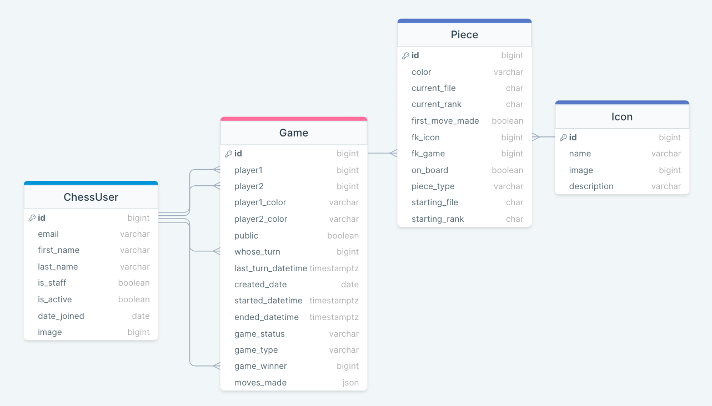

# Welcome to CheapChess
&nbsp;&nbsp;&nbsp;&nbsp;&nbsp;_"The leading free chess tutor that leverages AI technology for guided, experiential learning."_\
                       - Unattributed Author

Welcome to CheapChess, where beginners who don't want to pay the high cost of exquisite chess tutors can settle for the best
that artificial intelligence can offer.  Of course, large-language models (LLMs) aren't perfect - they can be slow, and they
can be wrong.  But, as beginners to the game of chess, we aren't aiming for perfect.  Mediocrity is just fine with us --
as long as we have fun, and save some cash!

## Database Design / Schema


## Frontend setup
  - Navigate to frontend / cheapchess directory
  - npm install
  - copy/paste 'import "bootstrap/dist/css/bootstrap.min.css";' into App.js

### Backend - create .env file to store secrets
* Create a .env file on the backend and add .env to .gitignore
* The OPENAI API key will be stored here with one line - export OPEN_AI_KEY="abcdefg..."
* The Django secret key will also be stored here with one line - DJANGO_SECRET_KEY = '...' (note: leave off 'export')

### Backend - create and activate Virtual Environment
* Navigate to wherever your virtual environment directory is located (i.e. ~ or CheapChess/backend/)
* ```source <virtual environment name>/bin/activate (source default/bin/activate)```

### Backend - Install Dependencies
* ```pip install -r requirements.txt```

### Backend - create a Local Database and migrate
* Recommend creating a database using PostgreSQL ($ createdb cheapchess_db)
* make sure to update settings.py with your database name
* cd into backend directory
* ```python manage.py migrate```

### Backend - create a superuser account
* cd into backend directory
* ```python manage.py createsuperuser```

### Backend - import icon fixtures into database
* cd into backend directory
* ```python manage.py loaddata icons_app/fixtures/icon_data.json```

### Download Free Chess Images
* You can download free chess images from flaticon.com.  Once you download them, you can import them into your database
by logging into your database as an admin.
* Make sure to attribute the icons to flaticon.com wherever you display them by putting this link on the webpage:
<a href="https://www.flaticon.com/free-icons/chess" title="chess icons">Chess icons created by apien - Flaticon</a> (Dark Knight)
<a href="https://www.flaticon.com/free-icons/pawn" title="pawn icons">Pawn icons created by VectorPortal - Flaticon</a> (Dark Pawn, Light Pawn)
<a href="https://www.flaticon.com/free-icons/chess" title="chess icons">Chess icons created by deemakdaksina - Flaticon</a> (Dark Rook, Light Rook, Dark King)
<a href="https://www.flaticon.com/free-icons/chess-piece" title="chess piece icons">Chess piece icons created by Freepik - Flaticon</a> (Dark Bishop, Light King)
<a href="https://www.flaticon.com/free-icons/chess" title="chess icons">Chess icons created by Victoruler - Flaticon</a> (Dark Queen, Light Queen)
<a href="https://www.flaticon.com/free-icons/chess" title="chess icons">Chess icons created by SBTS2018 - Flaticon</a> (Light Knight)
<a href="https://www.flaticon.com/free-icons/chess-piece" title="chess piece icons">Chess piece icons created by rizal2109 - Flaticon</a> (Light Bishop)

### Backend - start server
* Navigate to CheapChess/backend/
* ```python manage.py runserver```

### Backend - associate icon images to icon data
* navigate to http://localhost:8000/admin/  and login as superuser
* select icons model
* upload each image you downloaded (above) to the respective icon

### Start frontend server/app
* Navigate to CheapChess/frontend/cheapchess
* ```npm start```


